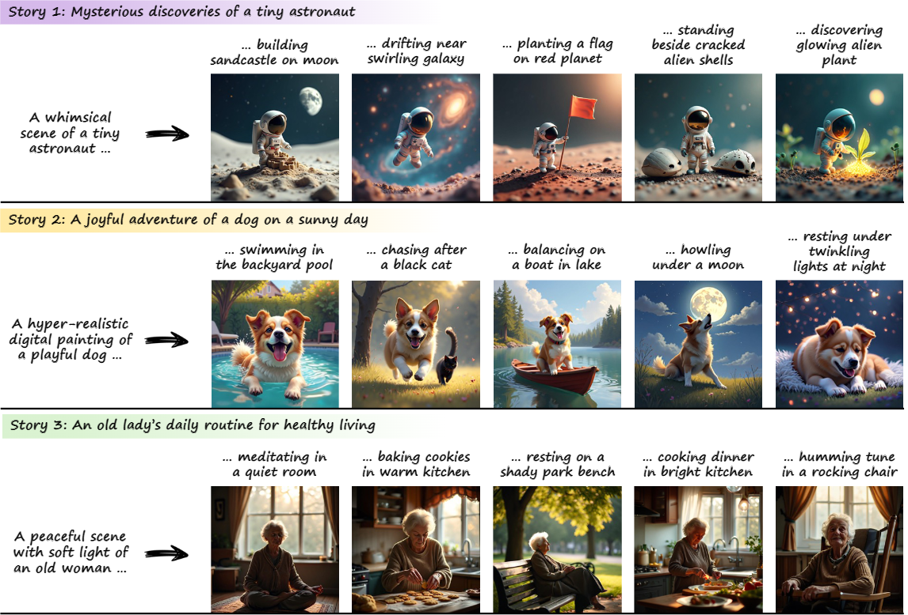

# Infinite-Story: A Training-Free Consistent Text-to-Image Generation (AAAI 26 Oral)

<div align="center">

[](https://arxiv.org/abs/2511.13002)
[](https://ojs.aaai.org/index.php/AAAI/article/view/37776)

**Jihun Park, Kyoungmin Lee, Jongmin Gim, Hyeonseo Jo, Minseok Oh, Wonhyeok Choi, Kyumin Hwang, Jaeyeul Kim, Minwoo Choi, Sunghoon Im**

Daegu Gyeongbuk Institute of Science and Technology (DGIST)

[[Paper (AAAI)]](https://ojs.aaai.org/index.php/AAAI/article/view/37776) | [[arXiv]](https://arxiv.org/abs/2511.13002) | [[Project Page]](https://jihun999.github.io/projects/Infinite-Story/)



</div>

## Abstract

We present **Infinite-Story**, a training-free framework for consistent text-to-image (T2I) generation tailored for multi-prompt storytelling scenarios. Built upon a scale-wise autoregressive model, our method addresses two key challenges in consistent T2I generation: identity inconsistency and style inconsistency. To overcome these issues, we introduce three complementary techniques: **Identity Prompt Replacement**, which mitigates context bias in text encoders to align identity attributes across prompts; and a unified attention guidance mechanism comprising **Adaptive Style Injection** and **Synchronized Guidance Adaptation**, which jointly enforce global style and identity appearance consistency while preserving prompt fidelity. Unlike prior diffusion-based approaches that require fine-tuning or suffer from slow inference, Infinite-Story operates entirely at test time, delivering high identity and style consistency across diverse prompts. Extensive experiments demonstrate that our method achieves state-of-the-art generation performance, while offering over **6x faster inference (1.72 seconds per image)** than the existing fastest consistent T2I models.

## Setup

### 1. Environment

```bash
conda create -n infinite_story python=3.10 -y
conda activate infinite_story
pip install -r requirements.txt
pip install flash_attn --no-build-isolation
```

**Note:** `flash_attn` requires `torch>=2.5.1` and a compatible CUDA toolkit. Install `torch` first, then `flash_attn`. Please refer to the [flash-attention installation guide](https://github.com/Dao-AILab/flash-attention) if you encounter issues.

### 2. Download Checkpoints

Download the following checkpoints from [FoundationVision/Infinity](https://huggingface.co/FoundationVision/infinity) and place them in the `weights/` directory:

| Checkpoint | Description | Link |
|:---|:---|:---|
| `infinity_2b_reg.pth` | Infinity-2B Transformer | [Download](https://huggingface.co/FoundationVision/infinity/blob/main/infinity_2b_reg.pth) |
| `infinity_vae_d32reg.pth` | Visual Tokenizer (d=32) | [Download](https://huggingface.co/FoundationVision/Infinity/blob/main/infinity_vae_d32reg.pth) |

The text encoder ([google/flan-t5-xl](https://huggingface.co/google/flan-t5-xl)) will be automatically downloaded on the first run.

```
weights/
├── infinity_2b_reg.pth
└── infinity_vae_d32reg.pth
```

## Inference

### Quick Start

```bash
bash scripts/infer.sh
```

This runs story generation with the paper's default configuration (`weight=0.85`).

### Custom Run

```bash
CUDA_VISIBLE_DEVICES=0 python story_generation.py \
    --pn 1M \
    --model_path weights/infinity_2b_reg.pth \
    --vae_path weights/infinity_vae_d32reg.pth \
    --text_encoder_ckpt google/flan-t5-xl \
    --prompt_path ./prompt/consistory_plus.yaml \
    --weight 0.85 \
    --exp_name ./output/my_experiment \
    --infer_type story
```

### Key Arguments

| Argument | Default | Description |
|:---|:---|:---|
| `--weight` | `0.85` | Adaptive Style Injection weight (controls consistency strength) |
| `--attn_control` | `True` | Enable Adaptive Style Injection |
| `--cfg_control` | `True` | Enable Synchronized Guidance Adaptation |
| `--text_replace` | `True` | Enable Identity Prompt Replacement (text embedding replacement) |
| `--text_scaling` | `True` | Enable Identity Prompt Replacement (text feature scaling) |
| `--seed` | `None` | Random seed (random if not specified) |
| `--prompt_path` | `./prompt/consistory_plus.yaml` | YAML file with story prompts |

### Prompt Format

Prompts are defined in YAML format. See `prompt/consistory_plus.yaml` for examples:

```yaml
animals:
- style: A fiery and majestic illustration of
  subject: A phoenix with bright orange feathers
  settings:
  - rising from a fiery ashes
  - soaring through a glowing sky
  - perching on a mountain peak
```

## Evaluation

We provide an evaluation script that computes four metrics:

| Metric | Measures | Direction |
|:---|:---|:---|
| **DreamSim** | Style consistency | Lower is better |
| **CLIP-I** | Image-level consistency | Higher is better |
| **DINO** | Style consistency | Higher is better |
| **CLIP-T** | Text-image alignment | Higher is better |

### Run Evaluation

```bash
# Evaluate generated images
bash scripts/evaluate.sh ./output/story_generation 0

# Or directly:
python evaluate.py --dir ./output/story_generation --gpu 0 --remove_background
```

Evaluation dependencies (`dreamsim`, `clip`, `carvekit`, `scikit-learn`) are included in `requirements.txt`.

## Project Structure

```
├── story_generation.py              # Main inference script
├── evaluate.py                      # Evaluation metrics script
├── scripts/
│   ├── infer.sh                     # Inference script (paper defaults)
│   └── evaluate.sh                  # Evaluation script
├── tools/
│   └── run_infinity.py              # Model loading & generation utilities
├── infinity/                        # Infinity model framework
│   ├── models/
│   │   ├── infinity_batch_story_generate.py  # Story generation transformer
│   │   ├── basic_batch_story.py              # Story-specific attention blocks
│   │   ├── infinity.py                       # Base Infinity transformer
│   │   ├── basic.py                          # Base attention blocks
│   │   └── bsq_vae/                          # Visual tokenizer (VAE)
│   └── utils/
│       ├── dynamic_resolution.py             # Multi-scale resolution configs
│       ├── dist.py                           # Distributed utilities
│       └── misc.py                           # Miscellaneous utilities
├── prompt/                          # Story prompt definitions
│   └── consistory_plus.yaml
│  
│  
└── weights/                         # Model checkpoints (download separately)
```

## Acknowledgements

This project builds upon [Infinity](https://github.com/FoundationVision/Infinity) by FoundationVision. We thank the authors for their excellent work.

## Citation

```bibtex
@inproceedings{park2026infinite,
  title={Infinite-Story: A Training-Free Consistent Text-to-Image Generation},
  author={Park, Jihun and Lee, Kyoungmin and Gim, Jongmin and Jo, Hyeonseo and Oh, Minseok and Choi, Wonhyeok and Hwang, Kyumin and Kim, Jaeyeul and Choi, Minwoo and Im, Sunghoon},
  booktitle={Proceedings of the AAAI Conference on Artificial Intelligence},
  volume={40},
  number={10},
  pages={8278--8286},
  year={2026}
}
```

## License

This project is licensed under the MIT License - see the [LICENSE](LICENSE) file for details.
